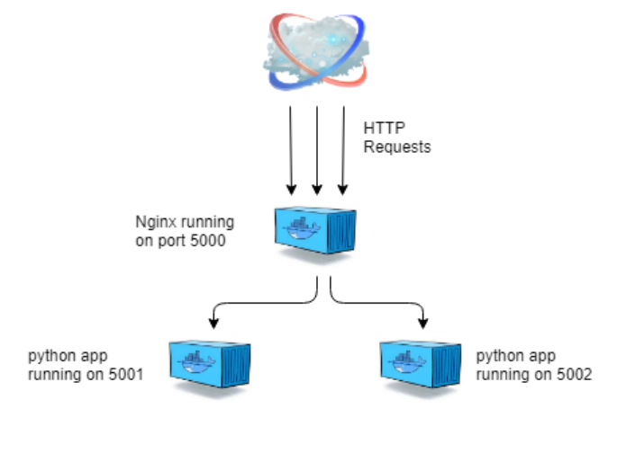

# AEDIFY

### Objective
Prepare a little CRUD application to manage excavators and other construction machinery. 
We're expected to see about 1000 concurrent users, mostly retrieving information and rarely updating data.

### Tasks

-   Required features:
    -   API endpoints to create and update a machine.
    -   API endpoints to list all available machines for a specific date.
    -   For machines we need to store labels, inventory IDs and machine types (just make some up).
    -   An API endpoint to mark a machine "in-maintenance" for a specified duration.
    
- Choice of frameworks, design and technologies is up to you. Make sure the solution is up to your standards 
and "production ready" (given the limited time) from a design standpoint. 
- Please do not spend more than 4 hours on this. 
- We'd suggest you use e.g. an in-memory database or dictionary for persistence to limit complexity. 

If you run out of time just scaffold the missing components and describe what is missing in our meeting. 
Your could should run, but it is okay if part of the functionality is only mocked.
If you are missing some requirements or domain clarifications, use assumptions and document them.

## ERD Diagram
   +-----------------+
   |     Machine     |
   +-----------------+
   | MachineID (PK)  |
   | Label           |
   | Inventory ID    |
   | Machine Type    |
   | Machine Price   |
   | In Maintenance  |
   | Maintenance Start Date |
   | Maintenance End Date   |
   | Creation Date   |
   +-----------------+

### Python scalable Flask application using docker-compose and Nginx load balancer

### Load Balancing using Nginx
Load balancing with Nginx uses a round-robin algorithm by default if no other method is defined. 
With round-robin scheme each server is selected in turns according to the order we set them in the Nginx.conf file.

#### Deploy and Scale our Flask application
    docker-compose up --build -d --scale app=3

#### SQLite Shell
    sqlite3 .\machinery.db
    
